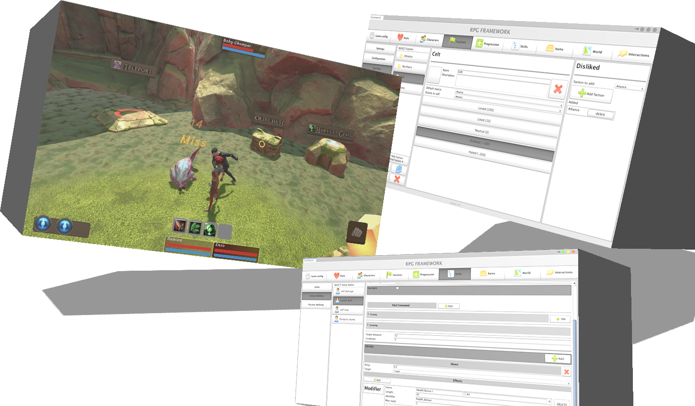

[](https://delmarle-damien.gitbook.io/core-rpg/) [](https://discord.gg/9GRnNM)  [](https://unity3d.com/get-unity/download/archive)
<p align="center">
  
</p> 

# What is Rpg Station?
its a framework that want to simplify creation of RPG games but still provide flexibility, so you can make any type of game with included functionality. If the game you want to make is not possible out of the box, it will be very easy to add specific logic.


# Requirement:
- Unity 2019+
- Adressables
- Dotween is optional
# Feature list:
- Saving system
- hotswappable Mechanics:
  - Swappable character creation
  - Swappable Ui
  - Swapable character Controller / input / camera
- Stats: Attributes, Vitals, Statistics, Elements
- Characters: Races, Player classes, Npcs
- Party, switch Character
- Factions
- Abilities
- Skills
- World, Scenes Data, Spawners, Portals
- Interaction: Button, harvestNode, portal, chest
- Spawning for characters and any objects, use rules and state can be saved 
- Items with different types and functionalities.
- Container, for players inventories or chests..
# What is in progress: 
- Equipment
- Character AI
# Next features: 
- Status Effects extended
- Hate system
- Counters system
- Quest system
- Crafting
# How flexible it is?
- none of the stats / skills / names / vitals / Character creation, Ui whatever are hardcoded, they care configured through editor.
- each character will instantiate a scriptable object "calculator" that will be responsible for calculation, tell other component what to do.
- hot swappable Mechanics feature, that allow you to change controls, component, inputs of your game in a click of a button. that mean you can use ClassicRpgMechanics to have a team based rpg, then change to FPSRpgMechanics and your game will play like skyrim. this does not need to reconfigure your data or your scenes

# How to:
How to create my Own mechanics:

Simply override CharacterBuilder to create you specific builder for players, npcs, pets. Then assign it to you any of your mechanics:


``` csharp
using System;
using System.Collections.Generic;
using UnityEngine;

namespace Station
{
    [CreateAssetMenu]
    public class PlayerCharacterBuilder : CharacterBuilder
    {
        

        public override Type GetMatchingType()
        {
            return typeof(PlayerCharacterType);
        }

        public override void Build(BaseCharacter character, BaseCharacterData baseData, object[] data)
        {
           var dbSystem = RpgStation.GetSystemStatic<DbSystem>();
            var classDb = dbSystem.GetDb<PlayerClassDb>();
            var ActiveAbilityDb = dbSystem.GetDb<ActiveAbilitiesDb>();
            var PassiveAbilityDb = dbSystem.GetDb<PassiveAbilitiesDb>();
            PlayerClassModel classData = (PlayerClassModel)data[0];
            PlayersData save = (PlayersData)data[1];
            var model = classDb.GetEntry(save.ClassId);
         
            if (model.StatsCalculator)
            {
                var calculatorInstance = Instantiate(model.StatsCalculator, character.transform) as PlayerCalculations;
                if (calculatorInstance == null)
                {
                    Debug.LogError("missing calculator");
                    return;
                }

                calculatorInstance.PreSetup(classData);
                
                character.Init(baseData.CharacterId,save.RaceId, save.FactionId, save.GenderId, calculatorInstance, save.Name);
                character.SetupAction(model.Attack);     
                character.AddMeta(StationConst.CLASS_ID, save.ClassId);
                character.AddMeta(StationConst.CHARACTER_ID, data[2]);
                character.AddMeta(StationConst.ICON_ID, model.Icon);
                character.gameObject.name = "[player] "+save.Name;
                
                character.SetupStats(model.HealthVital,null,model.EnergyVitals.ToArray());
                character.Stats.SetVitalsValue(save.VitalStatus);
                character.GetInputHandler.InitializePlayerInput(PlayerInput.Instance);
                
                #region ABILITIES
                //load from save
                List<RuntimeAbility> tempList = new List<RuntimeAbility>();
                foreach (var ab in save.LearnedActiveAbilitiesList)
                {
                    var ability = new RuntimeAbility();
                    ability.Initialize(ActiveAbilityDb.GetEntry(ab.Id),ab.Rank ,ab.CoolDown, character,ab.Id);
                    tempList.Add(ability);
                }
                character.Action.SetAbilities(tempList, character);
                
               //set binds
               var binds = new Dictionary<string,List<BarSlotState>>();
               var mainBarBinds = new List<BarSlotState>();
               foreach (var barState in save.BarStates)
               {
                   if (barState.Id == "main")
                   {
                       mainBarBinds = barState.Slots;
                   }
               }
               binds.Add("main", mainBarBinds);
                character.Action.BuildBinds(binds);
                //passive Abilities
                List<RuntimePassiveAbility> passiveList = new List<RuntimePassiveAbility>();
                foreach (var ab in save.LearnedPassiveAbilitiesList)
                {
                    var ability = new RuntimePassiveAbility();
                    ability.Initialize(PassiveAbilityDb.GetEntry(ab.Id),ab.Rename, character);
                    passiveList.Add(ability);
                }
                
                character.Action.SetPassiveAbilities(passiveList, character);

                //skills
                
                
                #endregion
            }
            else
            {
                Debug.LogError("MISSING CHARACTER CALCULATOR");
            }

        }
    }

}

```
Documentation: WIP https://delmarle-damien.gitbook.io/core-rpg/
